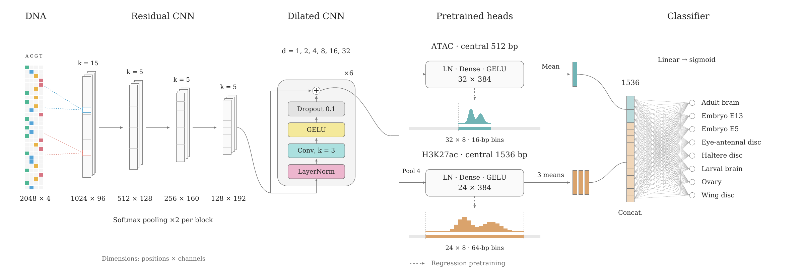

# Enhancer pleiotropy model

Reproduce the v4 Drosophila sequence-model comparison: process inputs, train
ATAC/H3K27ac regressors, train eight-context classifiers from scratch or by
fine-tuning, then generate nucleotide attributions and native-enhancer motifs.
An archived Figure 3 also has a standalone, source-data replay command.

Start with **[reproduce/config.yaml](reproduce/config.yaml)** and
**[the reproduction guide](docs/reproduction.md)**. This workflow reuses the
existing scientific implementations; it does not depend on a CECAR hostname,
another repository checkout, a RunPod backup, or an absolute researcher path.
For the measured outcomes, see the **[paper benchmark tables](docs/paper_benchmarks.md)**:
94 completed models, three-seed comparisons, per-context metrics and checkpoint provenance.
The portable workflow trains the primary three architectures below; the tables
also retain the historical EnhancerNet and shorter-input studies separately.

## Models

All models in this workflow take 2,048 bp and predict eight contexts:
`ab, e13, e5, ead, hid, lb, o, wid`. `e11` is excluded.

| Architecture | Regressor | Classifier scratch / fine-tuning |
|---|---|---|
| Dilated CNN | Shared 4x stem + six dilated convolution blocks | Legacy replacement readout, or retained assay hidden heads |
| CNN + attention | Same stem + attention blocks | Legacy replacement readout, or retained assay hidden heads |
| Flatten/dense CNN | Same stem + flatten + two shared dense blocks | Keep shared dense blocks; replace final signal projections |

The recommended historical classifier is the **background-trained, regressor-
pretrained dilated CNN with retained assay hidden heads**, seed 20260914,
selected epoch 38. Its validation macro AP was 0.648744 among enhancers and
0.586317 among enhancers plus background. These are reference results, not
results of a new run. The enhancer-only legacy CNN scored better on enhancer-only
discrimination (validation AP 0.666546) but worse with background (test combined
AP 0.514694 versus 0.582833). There is no population-independent winner.
See [all benchmark tables](docs/paper_benchmarks.md) and
[scientific contracts](docs/reproduction_science.md).

[](docs/figures/best_model_architecture.svg)

The best background-trained classifier has **1,244,168 parameters**. Dashed
signal branches show regressor pretraining only; the classifier retains their
hidden layers, not their signal outputs.
[Vector figure](docs/figures/best_model_architecture.svg) ·
[PDF](docs/figures/best_model_architecture.pdf).

For CNN/attention, `legacy` discards the two assay hidden heads; the corrected
`retained_assay_hidden_v1` transfers and fine-tunes them. Both also transfer
the encoder. These readouts differ architecturally, so this is **not a
weight-initialization-only ablation**. Dense's historical `legacy` identifier
already retains its shared dense representation.

Choose a named recipe with `--recipe` in both the stage CLI and Slurm submitter:

| Recipe | Regressors | Classifier fits | Comparison |
|---|---:|---:|---|
| `best` | 1 | 6 | Dilated CNN, retained hidden heads, background, scratch vs fine-tuning |
| `architectures` | 3 | 18 | CNN, attention, flatten/dense; background; scratch vs fine-tuning |
| `readouts` | 2 | 24 | CNN/attention; replace vs retain hidden heads; enhancer-only; scratch vs fine-tuning |
| `full` | 3 | 60 | All supported architectures, readouts and training populations |

All use three classifier seeds and one parent regressor per architecture, 40
epochs and the original LR schedules. Recipes only select the matrix; they do
not alter losses, scaling, splits or attribution settings. Outputs are isolated
under `paths.work/RECIPE`. Omitting `--recipe` preserves the original full matrix
and work directory. The full matrix includes 12 legacy-readout/background fits
that have **no historical result yet**; planned fits are never labeled measured.

## Layout

```text
reproduce/config.yaml             Experiment matrix, inputs, analysis choices
reproduce/regression.yaml         Frozen scientific regressor configuration
reproduce/requirements-*.txt       Training and TF-MoDISco environment pins
reproduce/slurm/                  Generic Slurm entry point + dry-run submitter
reproduce/figure3/                Checksummed plotted values for the archived figure
reproduce/benchmarks/models.json  Public-path-safe historical metrics and checkpoints
experiments/reproduction/         Thin, portable orchestration
experiments/classifier_transfer/  Regressors, classifiers, data, metrics
experiments/classifier_motifs/    Attribution kernels
experiments/classifier_modisco/   Native-length discovery, filtering, figure code
src/enhancer_pleiotropy_model/    Preprocessing, profile models and training
scripts/reproduce.py              Single stage-based command
scripts/summarize_paper_benchmarks.py  Rebuild/check the GitHub benchmark tables
```

Historical experiments and site launchers are preserved, not silently rewritten.
The old README is [archived](docs/legacy_regressor_readme.md).
`config/default.yaml`, `Snakefile`, and `cluster/` are **not** the new workflow's defaults.

## Quick start

Use Python 3.11. Create environments **on the destination machine**; do not copy
a local environment. Install on a permitted setup/compute node, following
your cluster's policy. Do not modify an existing environment used by running jobs.

```bash
python3.11 -m venv .venv-reproduce
.venv-reproduce/bin/python -m pip install torch==2.5.1 --index-url https://download.pytorch.org/whl/cu118
.venv-reproduce/bin/python -m pip install -r reproduce/requirements-train.txt
.venv-reproduce/bin/python -m pip check

python3.11 -m venv .venv-modisco
.venv-modisco/bin/python -m pip install -r reproduce/requirements-modisco.txt
.venv-modisco/bin/python -m pip check
```

Install MEME Suite **5.5.9** separately (e.g. a cluster module or a dedicated
Bioconda environment) and make `tomtom` available to MoDISco jobs. Record
`pip freeze` for both environments and `tomtom -version`. No dependencies or
motif databases are downloaded implicitly by the analysis commands.

Place the checksummed **v4 input export** at the configured archive path.
It contains the dm6 reference/blacklist, master DHS, H3K27ac peaks, normalized
BigWigs and enhancer catalog. This pipeline starts from that processed-data
boundary, **not FASTQ files**. The export and checkpoints are not bundled in
Git and currently have no configured public download URL. See the
[input contract](docs/reproduction.md#input-data).

```bash
.venv-reproduce/bin/python scripts/reproduce.py plan --recipe best
cp reproduce/slurm/site.example.yaml reproduce/slurm/site.yaml
# Edit site.yaml: interpreter paths, account, partitions, GPU type and limits.
.venv-reproduce/bin/python reproduce/slurm/submit.py preprocessing --recipe best --site reproduce/slurm/site.yaml
```

That last command only prints the plan. Add `--execute` after checking it.
Then submit `training --recipe best` after preprocessing finishes, and `analysis --recipe best` after
training/calibration. Each pipeline uses `afterok` dependencies internally.
See the guide for task indices, checkpointed resumption and monitoring.

GPU stages refuse to run outside a Slurm compute allocation. CPU stages can
run locally only with `--local-cpu`. **Nothing is submitted just by installing,
planning, importing modules, or running the CPU tests.**

## Attributions, motifs and the paper figure

New analysis retains full 2,048-bp actual and hypothetical IG for eight
calibrated probabilities plus mean observed-active-context logit. Production
uses 100 shuffled references and IG64, gated by a numerical pilot on each GPU
type. Summing the eight probability maps yields calibrated-breadth attribution.
TF-MoDISco uses **native enhancer intervals**, training enhancers only, positive
and negative motifs, information-filtered cores, and no extra reclustering.
Tomtom and a self-contained HTML motif report use locally supplied databases.

The archived September 20 paper figure used a **different, enhancer-only legacy
checkpoint and 50-reference attribution**. Replay it without inference:

```bash
CUDA_VISIBLE_DEVICES='' .venv-reproduce/bin/python scripts/reproduce.py figure \
  --local-cpu --output output/pdf/figure3_replay.pdf
```

This re-renders the saved plotted values; it does not claim to recalculate
the old attribution/discovery. Panel A is omitted. The added enhancer examples
make the final layout B–E. [Figure provenance and raw-analysis code](reproduce/figure3/README.md).
This fixture is **not the newer September 29–30 masked-context/family Figure 3**.
That later analysis is not yet connected to this portable figure command.

## Verification and portable export

```bash
CUDA_VISIBLE_DEVICES='' PYTHONPATH=src:experiments:scripts \
  .venv-reproduce/bin/python -m pytest tests/test_reproduction.py tests/test_calibrated_attribution.py tests/test_paper_benchmarks.py

.venv-reproduce/bin/python scripts/reproduce.py inventory --recipe best --local-cpu
.venv-reproduce/bin/python scripts/summarize_paper_benchmarks.py --check
.venv-reproduce/bin/python scripts/export_reproduction_release.py --output results/reproduction_source.tar.gz
```

The export command is also dry-run by default; add `--write` to create an
allowlisted source archive. It excludes data, checkpoints, run logs, site
credentials and dated submission scripts. No upload, Git commit or push is
performed. Undefined metrics remain null/blank, never invented zeros.

[Verification results and remaining limits](docs/reproduction_verification.md):
76 passed in the current publication CPU suite and in a clean source export.
The earlier cleanup also passed 95 tests/7 skipped and verified exact archived
PDF replay with the original reporting version. Full training
and native TF-MoDISco execution were not rerun during the cleanup.

The source workflow and historical benchmark are separate from a public data/model
release: the checksummed v4 export still needs a stable download/deposit, and a
fresh end-to-end cluster run remains to be validated. Installing the source alone
does not supply training data or pretrained checkpoints.
